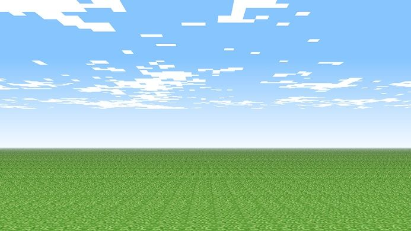

# 🚀 Tank Wars | Neon Edition

 Un juego de artillería táctica por turnos desarrollado completamente con **HTML5 Canvas** y **JavaScript Vanilla**. Este proyecto presenta una estética *Cyber-Glass* (Glassmorphism) con efectos de neón, físicas de tiro parabólico y una Inteligencia Artificial dinámica. 

🎮 **[¡Juega Tank Wars en vivo aquí!](https://juani342.github.io/tanques-guerra-/)**

---

## ⚙️ Características Principales

* **Combate 1 vs IA:** Enfréntate a un tanque enemigo controlado por el sistema que calcula el ángulo y la potencia basándose en la distancia real para contraatacar.
* **Dificultad Dinámica y Progresiva:** Cada nivel superado altera el campo de batalla añadiendo búnkeres de madera, obstáculos de piedra flotantes y techos opresores que obligan a recalibrar la estrategia de tiro.
* **Físicas de Proyectiles:** Implementación de tiro parabólico con gravedad aplicada, cálculos de velocidad en ejes X/Y y radios de explosión dinámicos.
* **Sistema de Puntuación (High Score):** Recompensas por impactos directos, demolición de estructuras y bonificaciones por limpieza de nivel.
* **Diseño *Cyber-Glass*:** Interfaz de usuario construida con Bootstrap 5, fusionada con estilos CSS personalizados para lograr sombras luminosas (Neón) y desenfoques de fondo.
* **Interacción Híbrida:** Uso del teclado/sliders para el control de artillería y eventos de mouse (Clic directo) para eliminar anomalías aéreas (nubes) y obtener puntos extra.

---

## 🛠️ Tecnologías Utilizadas

* **Lógica y Físicas:** JavaScript (ES6+), modularizado mediante POO (Clases `Tank`, `Bullet`, `Structure`, `Cloud`).
* **Renderizado Gráfico:** API de HTML5 Canvas (`ctx.arc`, `ctx.createLinearGradient`, `ctx.shadowBlur`).
* **Maquetado y Estilos:** HTML5, CSS3 (Variables nativas) y **Bootstrap 5.3** para la estructura responsiva del panel de control.

---

## 📂 Arquitectura del Proyecto

El código fuente está estructurado de manera modular para separar la interfaz gráfica de la lógica de renderizado:

```text
📦 tanques-guerra-
 ┣ 📂 assets
 ┃ ┣ 📂 css
 ┃ ┃ ┗ 📜 styles.css       # Efectos Neón y Glassmorphism
 ┃ ┣ 📂 img
 ┃ ┃ ┣ 📜 background.jpg
 ┃ ┃ ┗ 📜 favicon.png
 ┃ ┗ 📂 js
 ┃   ┣ 📜 Bullet.js        # Físicas, gravedad y explosiones
 ┃   ┣ 📜 Cloud.js         # Entidades interactivas de fondo
 ┃   ┣ 📜 Structure.js     # Obstáculos, búnkeres y daños
 ┃   ┣ 📜 Tank.js          # Renderizado de vehículos y UI de HP
 ┃   ┗ 📜 main.js          # Game Loop principal, IA y control de estado
 ┣ 📜 index.html           # Estructura del DOM y HUD
 ┗ 📜 README.md